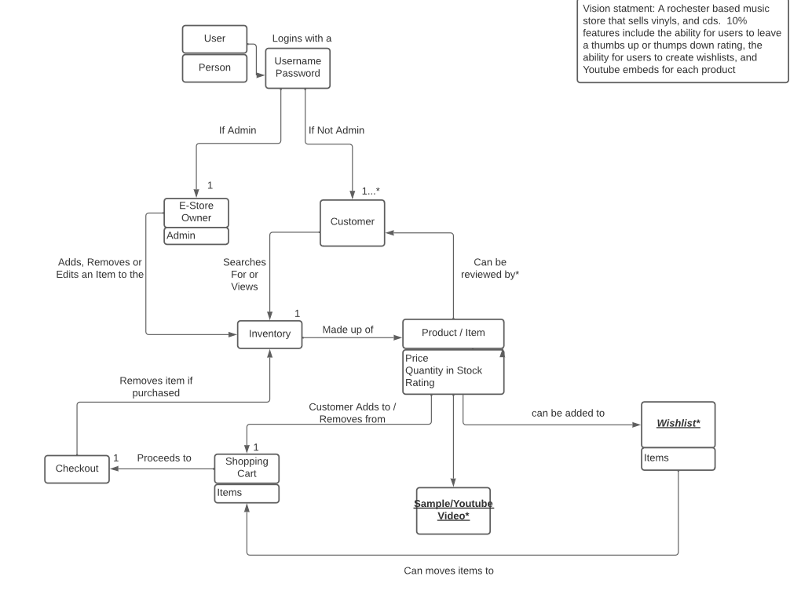
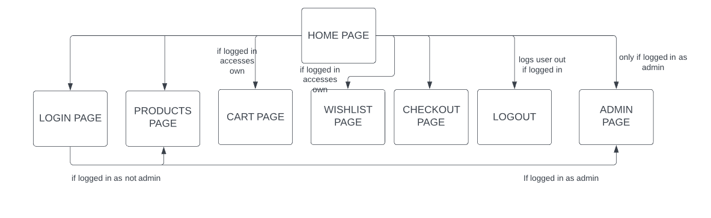
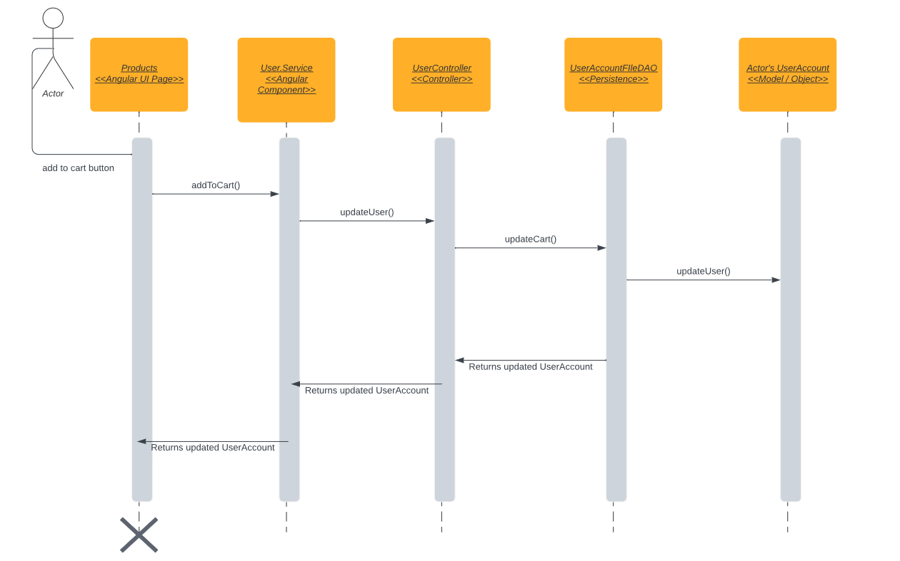
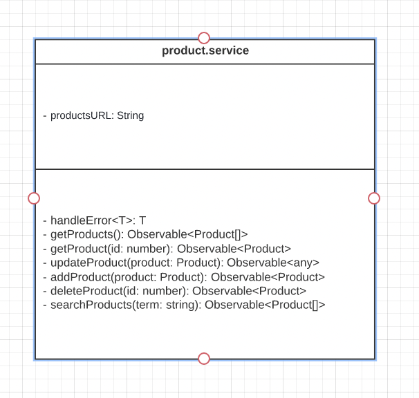
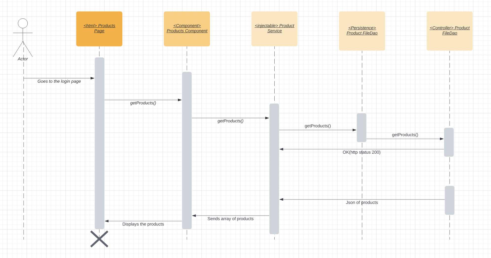
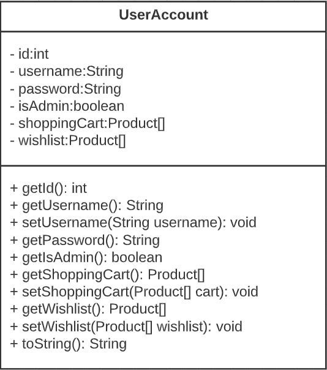
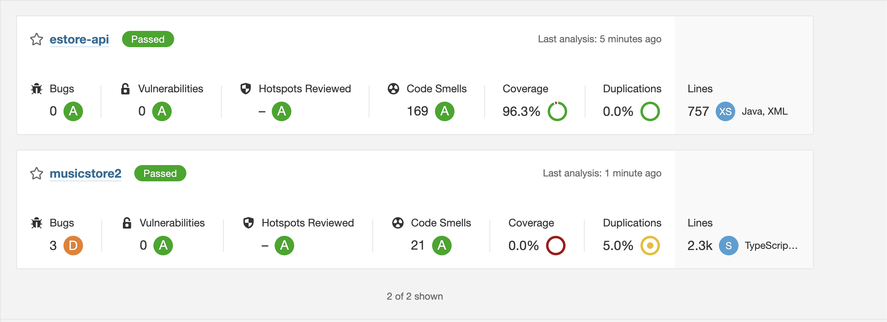
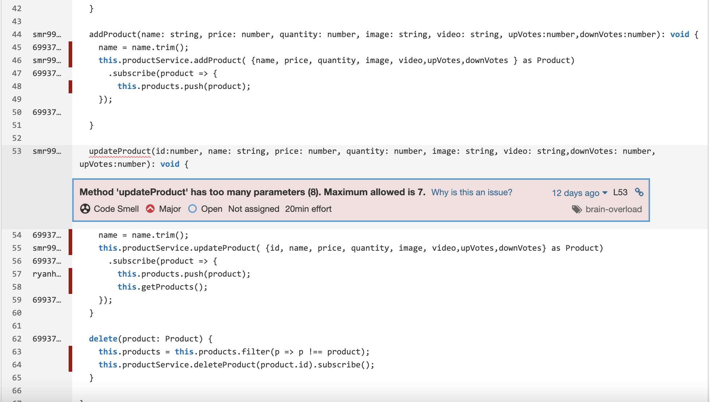
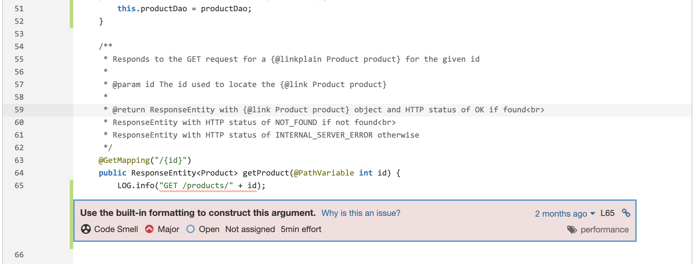
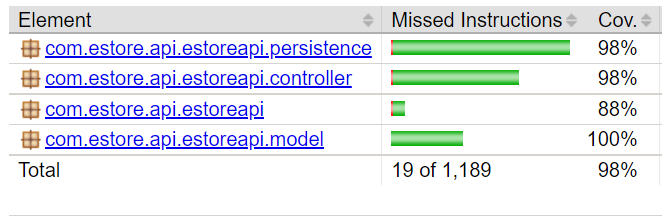

# PROJECT Design Documentation

## Team Information
* Team name: TEAMMUSIC
* Team members
  * Aaron Santos
  * Darian Cheung
  * Ryan Haver
  * Victor Oliveira
  * Spencer Randolph 

## Executive Summary
* Our project is an estore specializing in the sale of music products such as albums and music-playing devices.

### Purpose
* The purpose of this project is to connect the store owner with consumers by creating an estore that allows consumers to purchase products.

### Glossary and Acronyms

| Term | Definition |
|------|------------|
| SPA | Single Page |
| DAO | Data Access Objec |
| MVP | Minimum Viable Product |
| UI  | User Interface |
| API | Application Program Interface |

## Requirements

This section describes the features of the application via its major User Stories.

* As an owner, I want to be able to add and remove inventory
* As an owner, I want to be able to update and edit items in the inventory
* As an owner, I want the theme and layout of the page to look appealing to customers
* As a customer, I want to be able to add and remove items from my shopping cart and wishlist
* As a customer, I want to be able to create an account and log in
* As a customer, I want to be able to see a homepage that is welcoming and can tell me what the store is about
* As a customer, I want to be able to purchase all my items through a checkout screen
* As a customer, I want to be able to search for products so I can have access to individual products.
* As a customer, I want to be able to preview a song via a Youtube link so I can see if I want to purchase the vinyl
* As a customer, I want to be able to rate/upvote a product so that I can let other users know what I think about the product
* As a customer, I want to be able to see an individual product page so that I can learn more about a product on its own

### Definition of MVP
The music e-store server will have minimal authentication after trusting the browser, so the customer/user will be able to log in to the e-store website with a unique username and created password; if the user is logged in as "admin", they are the owner of the e-store and will see a unique admin pager. The customers once logged in, their functionalities include seeing a list of products sold by the store; searching for a product; adding/removing items from their own shopping cart; proceed to check out their items for purchase. Meanwhile, the e-store owner will have the ability to add, remove, and edit items from the store's inventory. The system will also follow data persistence and store everything in multiple JSON files so that data can be stored even when the website/server is closed on the browser; that is, if a customer has items in their shopping cart (or wishlist), they should still see those items when they log back in. Also, if another user purchases items from the store, those items should decrease in quantity stock and be updated for all other users so that they are prohibited from purchasing more products than there are currently in stock. 

### MVP Features
Admin Functionalities / Inventory Management:
* Given I am logged as an admin when I navigate to the owner page then I should be able to * delete products
* Given I am logged in as an admin when I navigate to the owner page then I should be able to update products
* Given I am logged in as an admin when I navigate to the owner page then I should be able to create products

Login and Account Creation:
* Given I, a customer, submit a username and password to create a new account when that account does not already exist, then the same username and password can be used to login as it is saved.
* Given I am a customer when I try to login in with my own username and password then I should be able to log in to my account if the account exists for that username and password.

Customer Privileges and Functionalities:
* Given that I, a customer, am on the products page when there are products in the inventory then I see each product and short description.
* Given that I, a customer, am on the products page when there are products in the inventory then I see a means to add each product to my shopping cart.
* Given there are items in my shopping cart when I, a customer, request to make a purchase then those items should decrease in quantity.
* Given that I, a customer, have items in my shopping cart when I request to make a purchase then I should see no items left in my cart
* Given a product exits when I, a customer, search for that product then I should be provided with that product if it exists.
* Given that I, as a customer, want to add a product to my cart when I try to add more of that product to my cart then I should be never able to add more than the product quantity.

Data Persistence:
* Given that I, as a customer, log out of my account and exit the server and log back in, I should see the same items in my shopping cart with products quantity up to date.

### Roadmap of Enhancements
* Address the work-around for product quantity when two customers have the same item in 
their cart and attempt to purchase it at the same time.
* Update the admin page so that when updating a product, the fields are pre-populated with
the original information, making the user experience better. 

## Application Domain

> The domain of the application is retail sales. The application is designed around the User class. The User contains basic information like username, password etc. The user is either a customer or an administrator. The user can view products and add them to their shopping cart if they are logged in. The administrator can alter the product list and change prices.  

## Architecture and Design

### Summary

The following Tiers/Layers model shows a high-level view of the webapp's architecture.

The e-store web application, is built using the Model–View–ViewModel (MVVM) architecture pattern. 

The Model stores the application data objects including any functionality to provide persistance. 

The View is the client-side SPA built with Angular utilizing HTML, CSS and TypeScript. The ViewModel provides RESTful APIs to the client (View) as well as any logic required to manipulate the data objects from the Model.

Both the ViewModel and Model are built using Java and Spring Framework. Details of the components within these tiers are supplied below.

### Overview of User Interface

The user starts on the Home page which has links to all other pages. These links are accessible on all other pages. If the user click login page they are taken to a page where they can enter login information for an account and create a new account. If the user logins with a non-admin account they are taken to the products page, if they are logged in with an admin account they are taken to the admin page. If the user clicks the products page they are taken to page that lists all the products and has the functionality to add a product to the user's cart or wish-lit if they are logged in. If the user clicks the cart page they are taken to a page that displays their cart if they are logged in. If the user clicks the wish-list page they are taken to a page that displays their wish-list if they are logged in. If the user clicks the checkout page, the products in their cart are listed and a button is displayed that has the functionality to simulate a purchase by removing the products from the user's cart. If the user clicks logout, they are logged out of their account if they are logged in. If they are logged in as admin and click the admin page they are taken to a page that has the ability to delete a product and create new products.

### View Tier
* Our client UI is created using the Angular framework. The Angular framework of our client UI is then viewed using any web browser, which is run by an Operating System / hardware. Throughout our client UI their are various buttons that do specified things. When these buttons are clicked, data is passed through and functions from the REST API are called to achieve a specified task. For example, when a user clicks the add to cart button which is located on the products page of the UI, the "addToCart()" function in the products angular component is run and the product that is choosen is passed through. From there, the user.service in angular calls "updateUser()" in order to add that product to the user's cart. "updateUser()" calls "updateCart()" through an HTTP POST request. 

### ViewModel Tier

The ViewModel of the project that serves as the link between the view and the model are the product and user service components and the controller and DAO classes. These services will receive information from the backend, receiving information about the user and the products. The product service component has the responsibility of using user inputs and sending them to the model where data products will be moved, removed, etc. An example of this is when the user clicks on the products page, an HTTP GET call to getProducts() is made, where the product service will receive the json object with all the products, and display them as typescript Product objects.

As for the user service component, the user's input on the login page will have the service component retrieve info regarding the account back to display. The inputs are used to check if existing accounts have this user and password, through user service's searchUser(). The backend receives these inputs and does the searching, returning a user if it is found. The data is then set in variables in the component and can be used to display the unique information for each account.

### Model Tier

Our main model is the UserAccount model. This contains information about a user like username, password, their admin status, their shopping cart and wishlist. The shopping cart and wishlist are arrays of our other model which is Product. The product model contains information about the products that we sell on our store. This data includes id, name, price, quantity, the image and video source link, and how many upvotes/downvotes the product has.

### Static Code Analysis/Design Improvements

For the API, the UserController should be refactored to update a user's cart and wishlist without updating the entire entry. The way we implemented it for the MVP, when we need to update either the cart or the wishlist, we find the user with the DAO, then create a new user containing the updated cart or wishlist, then replace the existing user entry with the new one. This is an expensive operation to do everytime. We should just be updating the individual attributes of the user instead of the entire user itself. 

For the UI, I think we could improve our authentication process by using the local storage class provided in Angular. This would keep our user's information more secure and provide a better way of validating that a user is logged in. Right now, we check a boolean that is set in the authService service.  

The image below shows the only major issue in the UI identified by SonarQube and SonarScanner. This could be fixed by passing the current Product object and an updated Product object with new information. This would reduce the parameters from 8 to 2. 

The image below shows an issue in our API. In our logging, we are using the plus sign to concatenate strings for logging. The Java logger instead uses commas to separate strings that should be concatenated together in the log file. 

## Testing

Overall we were very succesfull on testing includint acceptence testing and unit testing. This was a result from our consistent comunication and being able to accurately define each task in trello with acceptence criteria. We also updated our unit testing at the end of the sprint to make sure it is up-to-date.

### Acceptance Testing
There are 20 user stories that have passed all of their acceptance criteria, 5 that haven't been implemented at the time of the testing(are now completed), and 2 that have failed. The main issue and only problem that we ran into during the time of testing was that in the console there weren't any http status logs so then some tests failed because of that. Another issue was regarding the readability of the admin page. Other than that, no issues were found during the testing, all are minors issues that can be fixed.

### Unit Testing and Code Coverage

Our unit testing stratagy was to update unit tests at the end of the sprint rather then implemnt after creating functions. This allowed for specific team members to focus in more on unit testing when they had completed their specific feature. We were able to achieve 98% code coverage. The goal was to achieve a minimum of 90% covrage and we were able to surpass that. The primary target of code covrage was core functions like the product class and controllers. Since functions like these are the root of our program and need to be working perfectly for the succes of the website.

